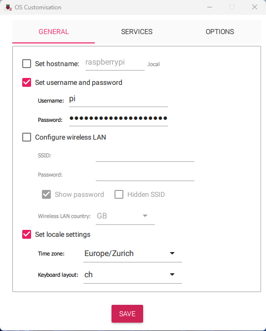

# Starting from Scratch
Assuming you use a Raspberry Pi 5. If you have some other hardware this steps may differ but still can be a usefull reference on what is needed.
Requirements:

- A Raspberry Pi 5 (R-Pi)
- A microSD card (16GB or larger recommended)
- A microSD card reader
- The pre-configured HAlpha image file. You will find the latest release in the source repo.
- Imaging software [Raspberry Pi Imager](https://www.raspberrypi.com/software/)

### Write image Steps
1. Open Raspberry Pi Imager.
2. Plug your sd card with your sd card reader to your computer.
3. Under `Raspberry Pi Device` select `Raspberry Pi 5`.
4. Under `Operating System`, under the menu `Raspberry Pi OS(other)` select `Raspberry Pi OS Lite (64-bit)`.
5. Under `Storage` choose you sd card.
6. Press `ctrl`+`shift`+`x` to open the OS Customisation menu. Under menu GENERAL do the following:
    - Unset the hostname
    - Set a username and password (for example username: pi and password: raspberry) you can also later change it with cmd `passwd`
    - If you connect over ethernet unset Wireless
    - Set your keyboard layout

7. Under SERVICES do the following:
    - Enable SSH 
    - Enable Use password authentication

8.  OS Customisation menu and press `next`.
9.  For the question `Would you like to apply OS customisation settings?` press yes. 
10.  Press again yes for formatting the sd  card. Then the image getts written to your sd card. (It can take some minutes.)
11.  Once the image is finished take the sd card and plug it into the unpowered Raspberry pi sd card slot.


### Get the source code
Once you have flashed the sd card you can plugin a keyboard, network cable and display to the raspberry pi and power it up. Now you should see a black starting screen loading up. 
Once finished it will ask to login with your prevvios set username and password.
1. Login using the username password we created in the imager
2. Get the hostname of the R-Pi with the command
```bash title="terminal"
pi@raspberrypi:~$ hostname -I
```
This will give you back the ip4 adress of your RP5.
```bash title="terminal output"
pi@raspberrypi:~$ hostname -I
172.16.10.250 2001:620:1b0:a:2895:867f:fead:9f52
```
Know we can use the ip4 adress to ssh into our R-Pi from within the same network
```bash title="cmd on your pc"
C:\Users\cedric.renda>ssh pi@172.16.10.250
```
!!!tip 
    if you already had an ssh connection under this ip4 address you will get an error:
    ```bash
    @@@@@@@@@@@@@@@@@@@@@@@@@@@@@@@@@@@@@@@@@@@@@@@@@@@@@@@@@@@
    @    WARNING: REMOTE HOST IDENTIFICATION HAS CHANGED!     @
    @@@@@@@@@@@@@@@@@@@@@@@@@@@@@@@@@@@@@@@@@@@@@@@@@@@@@@@@@@@
    ...
    ```
    to resolve this just navigate to the /.ssh folder and delete all the entries of this ip4 address from known_hosts file.

#### Install git
Now we have to install git to get the source code from the repo. To do this we first update the R-Pi and then install git:
```bash title="ssh terminal"
pi@raspberrypi:~ $ sudo apt-get update
pi@raspberrypi:~ $ sudo apt-get upgrade
pi@raspberrypi:~ $ sudo apt-get install git
```
Now we clone the source code from our repo. For this we create a directory in our home with 
```bash title="ssh terminal"
pi@raspberrypi:~ $ mkdir /home/pi/docs
pi@raspberrypi:~ $ cd docs
pi@raspberrypi:~ $ git clone https://github.com/pmodwrc/halpha.git
pi@raspberrypi:~ $ cd halpha
```
Now we sucessfully cloned the source repo! :fire:

#### Install other dependencies
To properly use python we need a virtual environment. For this we uses `venv` but you could also use `conda`.
```bash title="ssh terminal"
pi@raspberrypi:~/docs/halpha $ sudo apt-get install python3-venv
```
Since we use `opencv` we need to have libg installed. To do this we install 
```bash title="ssh terminal"
pi@raspberrypi:~/docs/halpha $ sudo apt-get install libgl1-mesa-glx
```
####Installing `Samba`
To later share our png files on a external drive we install `Samba` and the client `smbclient`. 
```bash title="ssh terminal"
pi@raspberrypi:~/docs/halpha $ sudo apt-get install samba smbclient
```
#### Setting up the virtual environment
To create an environment we go to our halpha directory and we run the venv command inside of python
```bash title="ssh terminal"
pi@raspberrypi:~/docs/halpha $ python -m venv <Path_to_your_venv>
```
in our case we just keep it close inside the our halpha directory thus the command is 
```bash title="ssh terminal"
pi@raspberrypi:~/docs/halpha $ python -m venv venv
```
If you type now `ls` you should see the `venv` directory :fire:. Once created we can activate it with following command. 
```bash title="ssh terminal"
pi@raspberrypi:~/docs/halpha $ source venv/bin/activate
```
!!!tip 
    Note that if you're in a different directory you need to specify the correct path to the venv directory. Once the venv is activated you should see the current activated environment in the first part of your terminal.

Now we install all the needed python packages we have in our code.
```bash title="ssh terminal"
(venv) pi@raspberrypi:~/docs/halpha $ pip install -r requirements.txt
```

#### Setup the Samba client
To do this you just need to configure to environment variables. Ask your sysadmin what is the username and password for your saba client and run in the terminal:
```bash title="ssh terminal"
pi@raspberrypi:~$ export SAMBA_USER=<your_user>
pi@raspberrypi:~$ export SAMBA_PASSWORD=<your_password>
```

#### Installing the camera driver

For this step we change the directory to `/camera_driver/raspberrypi_5`. Here we unpack the compressed driver file:
```bash title="ssh terminal"
(venv) pi@raspberrypi:~/docs/halpha/camera_driver/raspberrypi_5 $  tar -xvf sdk_libqhyccd_20240118.tar
```
this should create a `sdk_Arm64_24.01.09` directory. We inter this directory and run the installation script:
```bash title="ssh terminal"
(venv) pi@raspberrypi:~/docs/halpha/camera_driver/raspberrypi_5/sdk_Arm64_24.01.09 $ sudo ./install.sh
```
you can now test out if the driver got installed. There are test programms under `usr/local/testapp/` or you can run our python script to test out if the installation worked. 

For the second one go back to the root of halpha and go into the sun_catching directory. 
Try it out! Hook-up the camera and run the pythonscript! For this you run `python process.py`.

If everything went well you should be now setup and ready! :fire:

**Happy coding :sparkles:**
